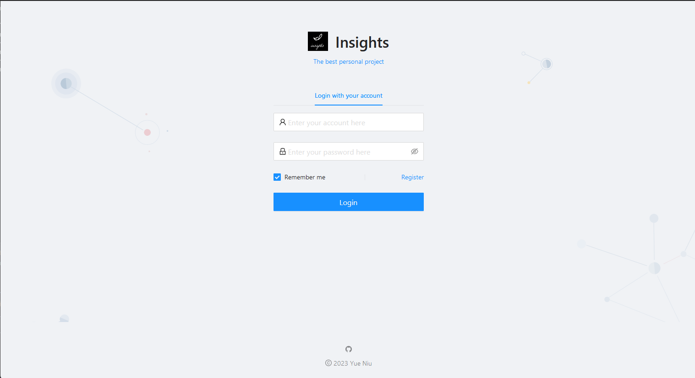
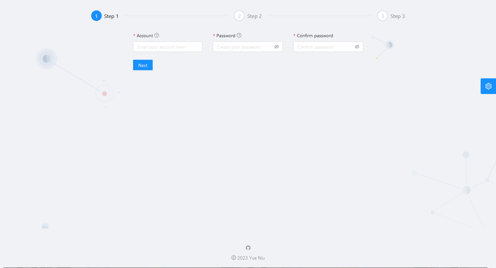

# User Center Management System

## Overview
The User Center Management System is a comprehensive solution designed to manage user registrations, login, and data retrieval functionalities in an efficient and secure manner. Leveraging a tech stack that includes Spring Boot, React, MySQL, MyBatis, Docker, and Nginx, this project presents a robust and scalable architecture, ensuring a smooth, unified, and scalable application delivery environment.

## Features
- **User Registration & Management**: Efficiently handle user sign-ups and manage user data.
- **Secure Login**: Robust user authentication and session management.
- **Responsive UI**: Intuitive and user-friendly interface built with React and Ant Design.
- **Secure & Scalable Backend**: Developed with Spring Boot and MyBatis.
- **Containerized Deployment**: Utilizing Docker and orchestrated via Nginx.
- **Robust Error Handling**: Implemented via a custom Global Exception Handler.

## Tech Stack
- **Frontend**: React, Ant Design
- **Backend**: Spring Boot, MyBatis
- **Database**: MySQL
- **Containerization**: Docker
- **Web Server**: Nginx

## Getting Started

This project is initialized with [Yue Niu](https://github.com/litlcute/UserCenterManager). Follow is the quick guide for how to use.

### Prerequisites
- Ensure that you have Docker, Java, Node.js, and Nginx installed.

### Installation & Setup
1. **Clone the repository**

   ```sh
   git clone https://github.com/litlcute/UserCenterManager.git

2. Frontend Setup

   Navigate to the frontend directory and install dependencies.

   ```
   yarn install
   ```

   This project provides some useful script to help you quick start and build with web project, code style check and test.

   Scripts provided in `package.json`. It's safe to modify or add additional script:

   To run the frontend locally:

   ```
   yarn start
   ```

   To build frontend locally:

   ```
   yarn build
   ```

3. Back-end setup

   ```sh
   run application.yml file to run backend server locally
   ```

   

4. Or you can Visit by IP in your browser

   ```
   use ip 1.117.62.199 in your browser
   it may take a little bit long time since this app is running on a cloud in Shanghai
   ```

## Demo

Provide details about how to use your system and any URL/routes to access its features.






## Contributors

- [Yue Niu] - [https://github.com/litlcute]

## Acknowledgments

Include credits, inspiration, or reference if any.

## Contact

- Your Name - [Yue Niu]
- Project Link: https://github.com/litlcute/UserCenterManager

