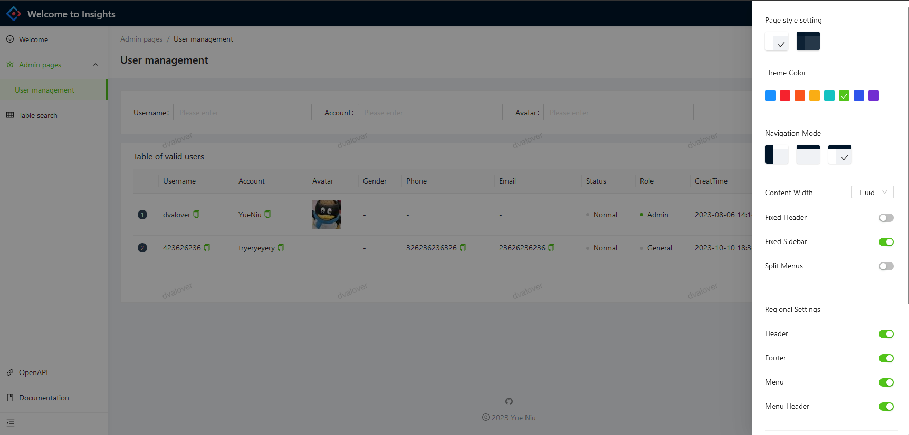
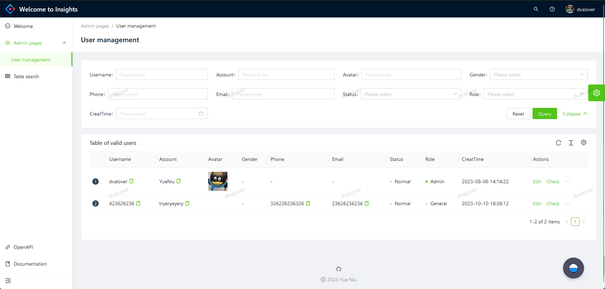
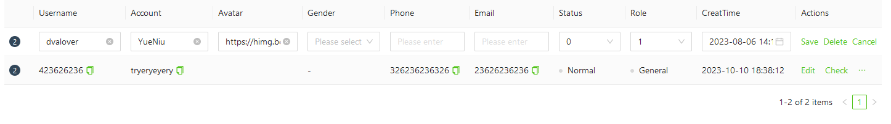

[](https://opensource.org/licenses/MIT)

# **Expandable UniAccSys（Universal Account System）**

## Overview
**"An Elegantly Modular User Management System"**

Designed and developed a full-stack, modular user management system with a robust Spring Boot backend and a responsive React frontend. Explicitly engineered with scalable architecture, "Extensible UserCenter" ensures seamless integration of additional modules and features, presenting a future-proof solution to complex user management and authentication needs across varied enterprise operations.

The UniAccSys is a comprehensive solution designed to manage user registrations, login, and data retrieval functionalities in an efficient and secure manner. Leveraging a tech stack that includes Spring Boot, React, MySQL, MyBatis, Docker, and Nginx, this project presents a robust and scalable architecture, ensuring a smooth, unified, and scalable application delivery environment.

## Features
- **User Registration & Management**: Efficiently handle user sign-ups and manage user data.
- **Secure Login**: Robust user authentication and session management.
- **Responsive UI**: Intuitive and user-friendly interface built with React and Ant Design.
- **Secure & Scalable Backend**: Developed with Spring Boot and MyBatis.
- **Containerized Deployment**: Utilizing Docker and orchestrated via Nginx.
- **Robust Error Handling**: Implemented via a custom Global Exception Handler.

## Tech Stack
- **Frontend**: React, Ant Design
- **Backend**: Spring Boot, MyBatis
- **Database**: MySQL
- **Containerization**: Docker， aaPanel
- **Web Server**: Nginx

## Getting Started

This project is initialized with [Yue Niu](https://github.com/litlcute/BackstageUsermanager). Follow is the quick guide for how to use.

### Prerequisites
- Ensure that you have Docker, Java, Node.js, and Nginx installed.

### Installation & Setup
1. **Clone the repository**

   ```sh
   git clone https://github.com/litlcute/UserCenterManager.git

2. Frontend Setup

   Navigate to the frontend directory and install dependencies.

   ```
   yarn install
   ```

   This project provides some useful script to help you quick start and build with web project, code style check and test.

   Scripts provided in `package.json`. It's safe to modify or add additional script:

   To run the frontend locally:

   ```
   yarn start
   ```

   To build frontend locally:

   ```
   yarn build
   ```

3. Back-end setup

   --firstly build the jar package by maven ->package func

   --navigate to back-end folder and then target folder

   --and then run the jar file

   ```sh
   java -jar .\user-center-backend-0.0.1-SNAPSHOT.jar --spring.profiles.active=prod
   ```


## Demo








## Contributors

- [Yue Niu] - [https://github.com/litlcute]

## Acknowledgments

Include credits, inspiration, or reference if any.

## Contact

- Your Name - [[Yue Niu](www.yueniu.me)]

## License

This project is licensed under the MIT License - see the [LICENSE.txt](LICENSE.txt) file for details.
